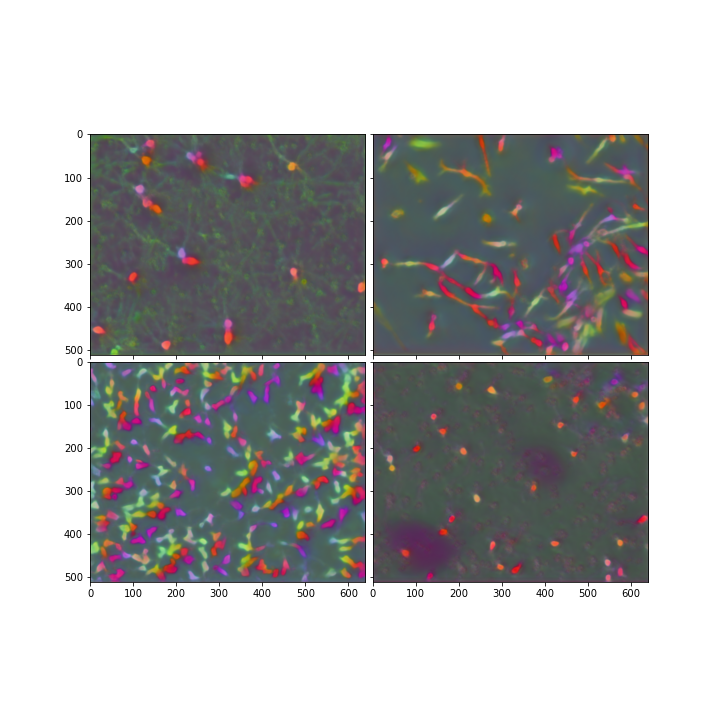

# Sartorius Kaggle competition (intermediate report)

### Data
The goal of competition is to detect single neuronal cells in microscopy images. The images are of 3 types: 
 - shsy5y
 - astro
 - cort

Images of each type are quite different, for instance, cort cell type contains small cells and density of cells is low, whereas shsy5y contains many cells of medium size, the density of cells is high. Example of shsy5y cell:

The main dataset contains about 600 images, the dataset is unbalanced, the more than a half of classed is cort. The dataset is accomplished with LIVECELL dataset and set of unannotated images. In notebook **DataAcquisition.ipynb** you may find more about data exploration including statistics and data visualizations. The experiments was conducted with only using the main dataset, ohter datasets will be included soon. 

### Task
The task is to detect instances of each cell in microscopy image.
The 2 approaches were considered: detection (for instance, R-CNN with postprocessing) and contrastive learning.

The **metric** used in this competition is the mean average precision at different intersection over union (IoU) thresholds. More details about metric: https://www.kaggle.com/c/sartorius-cell-instance-segmentation/overview/evaluation

*Approach*. Until now I was considering contrastive learning approach, more specifically pixelwise contrastive loss applied on prediction embeddings, the inspiration was found from this paper: https://arxiv.org/abs/2011.09157 . You may find loss implementations in src/losses.py. Since computing pairwise loss for all the pixels in the image is computationally infeasible (distance matrix of size (H * W) x (H * W) for image of shape [H, W]) two approaches were used:
 - uniform sampling of pixels 
 - "windowed" sampling of pixels

In uniform sampling we just consider random set of points of arbitary size when copmuting loss. In "windowed" approach we sample a set of pixels which form a window randomly placed on image. The windowed approach was proposed distinguish better between nearly located instances. 
Another approach that wasn't mentioned before is binary pixelwise contrastive loss (0 class - background, 1 - cell) and on top of it classifier built which predicts 3 classes (background, cell and cell border) which pending for experiments. 

*Architectures*. In the experiments UNet architectures were used with encoders starting with ResNet-18 and ending with EfficientNetV2-M; for smaller encoders considered RefineNet decoder: https://arxiv.org/abs/1611.06612 and for efficient net manually designed simple architecture with ConvTranspose layers, Upscale. Information leaking is provided by skip layers. More about last architecture you may find in src/models

*Preprocessing and augmentation*. As augmentations to improve score random brightness, contrast, horizontal flip were applied. For preprocessing were considered icreasing contrast and/or guiding input image with edges and/or countours computed with using OpenCV. Unfortunatelly, these approaches doesn't show any improvement comparing with image fed as is. 

*Postprocessing and results*. During the inference model predicts embedding (the optimal size is 8 obtained during experiments) for each pixel. The picture below shows visualizations of embeddings (PCA dimension reduction used to obtain RGB visualizations): 

 

After obtaining embeddings the postprocessing should be applied to get instance segmentation masks. The postprocessing is the following: 
 - resize embeddings image to 160x128
 - apply Agglomerative clustering on pixels (cosine distance as a metric with average linkage)
 - obtain instance labels with erosion + measure.label (scikit-image) method
 - upsample with Nearest Neighbor approach to original resolution

Another postprocessing approach was designed too (you may find implementation in Results.ipynb) but the obtained results are much worse. The postprocessing pipeline is in progress. The results of obtained instance segmentation masks, 

**Ground truth:**

 

<!--  -->

**Predictions:** 

 

<!--  -->

